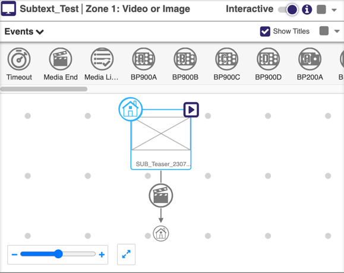
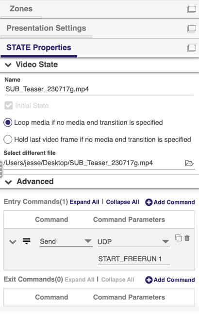
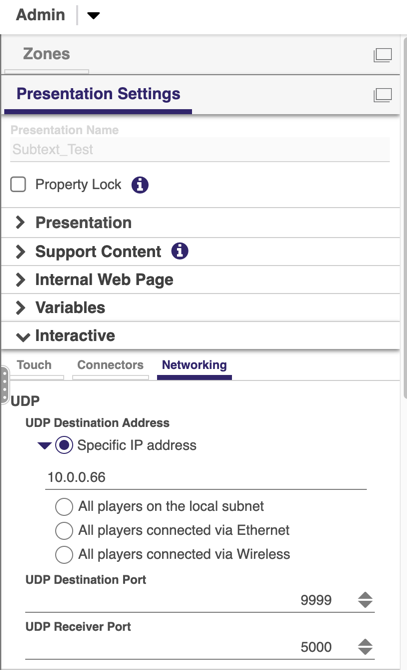

# Brightsign x Subtext
This example demonstrates a simple setup of a looping video running on a single Brightsign.

## Setup
* **Protocol**: UDP+Freerun
* **Hardware**:
* **Software**: BA Connected 1.16.0

## Instructions
1. Create a new presentation
2. Switch to "Interactive" mode
3. Create a new state with a Media End event that reenters that state.

4. Add an Entry command to the state.
5. Select "Send" and "UDP" 
6. Set "START_FREERUN 1" as the message. This will reset the freerunning timer to zero and start it.
7. Under "Presentation Settings", reveal the "Interactive" section

8. Select "Networking" and enter the node's media network IP address and set the "UDP Destination Port" to 9999
9. Save and publish the presentation to device.

## Example
Import the "Subtext_Text.bpfx" file into BA Connected