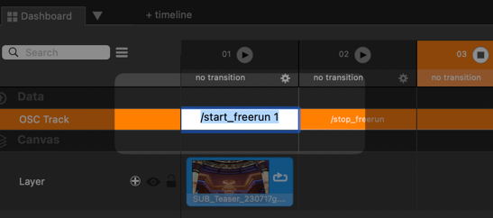

# Millumin x Subtext
Instructions for how to use Subtext with Brightsign with an accompanying example

## Setup
* **Protocol**: OSC+Freerun
* **Software**: Millumin 4.16.f

## Instructions
1. Add new Data track 
2. Add media to the dashboard
3. Select the data track and open the device management panel 
4. Add an OSC server if necessary and input the node's ip address and port. Ensure it is enabled ![add server]
   (assets/add_server.png)
5. Close the device management panel
6. On the data track, ensure the method is set to "command"
7. Add a string to the column and enter "/start_freerun 1" 

### N.B.
Looping videos will not re-trigger data track commands. You must set up a pair of auto-go commands, one to continue 
to the next column when the media is complete, and one to relaunch the first column. 

## Reference
https://help.millumin.com/docs/connect/devices/