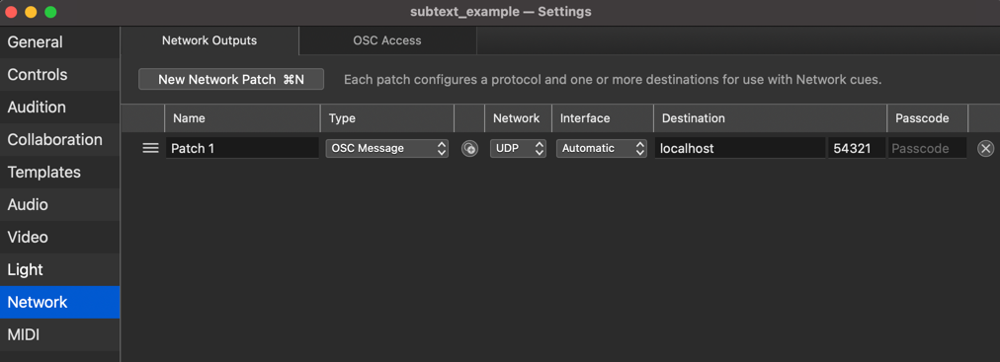
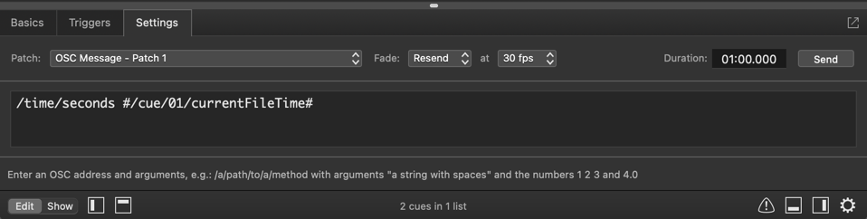

# QLab x Subtext
Instructions for how to use Subtext with QLab 5 with an accompanying example

## Setup
* **Protocol**: OSC
* **Software**: QLab 5

### License
You will need an active QLab license of any type to use any Network cues.

## Instructions
1. Setup Video output
2. Setup Network patch . Direct the output to the ip address of the node, and 
   port 54321. Ensure there is no passcode set.
3. Create new "Video" cue 
4. Create new "Networking" cue. 
5. Under its "Settings" tab, enter "/time/seconds #/cue/01/currentFileTime#" and direct it to use the 
   network patch output set above. 
6. Set the Video cue to auto-continue, so both cues fire simultaneously.
### N.B.
This uses the OSC query for "[currentFileTime](https://qlab.app/docs/v5/scripting/osc-dictionary-v5#cuecue_numbercurrentfiletime)," 
which is currently listed in the documentation as unable to be queried. I don't know if this is a mistake in the 
documentation or a mistake in the code.

## Example
1. Load "subtext_example.qlab5"
2. Swap out media file in cue 01
3. In the project's settings, direct the network patch to the ip address and port of the node.

## Reference
Here is Figure53's documentation for how to send a continuous OSC message:
https://qlab.app/docs/v5/scripting/osc-queries/#continuously-updating-queries

And for OSC Queries / commands:
https://qlab.app/docs/v5/scripting/osc-dictionary-v5