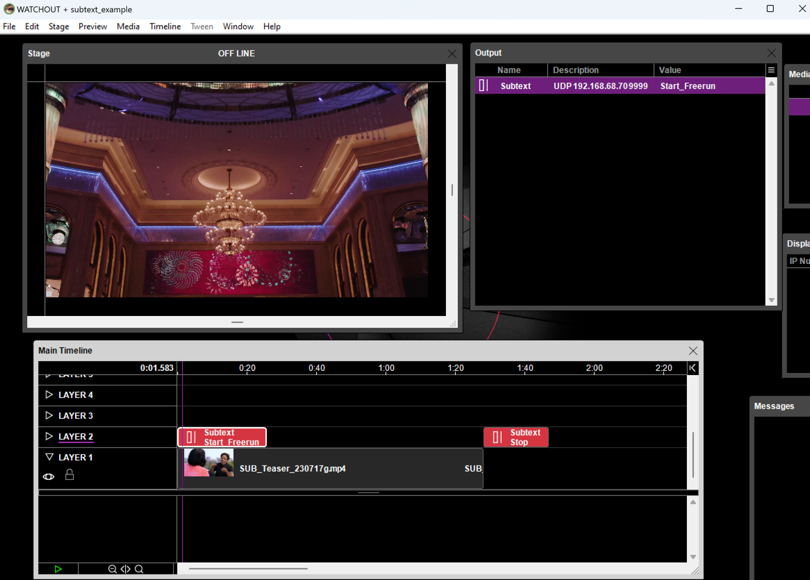

# Watchout x Subtext
Instructions for how to use Subtext with Wathcout with an accompanying example

## Setup
* **Protocol**: UDP+Freerun
* **Software**: Watchout 6.7.2

## Instructions
1. Add media file and place it on the timeline 
2. In the output window, add a "string" output: 
3. Direct the string output to the node's IP address and UDP port. Select "UDP"
4. Drag the output onto the timeline. 
5. Double-click the string cue, give it a descriptive name and enter "START_FREERUN::1" as the "Data to Send".
6. If the cue should be placed at the beginning of the timeline, enter a time of "0.01" (see note below) 
7. Repeat steps 4-5 to add a stop cue to the timeline with "STOP_FREERUN" as the data to send
8. Place it at the end of your media.

### N.B
Commands placed at 0 seconds on the timeline will not trigger. Place the start command at 0.01 if media starts at 
the beginning of the timeline

## Example

## Reference
https://www.dataton.com/watchout-users-guide/inputs-and-outputs/outputs